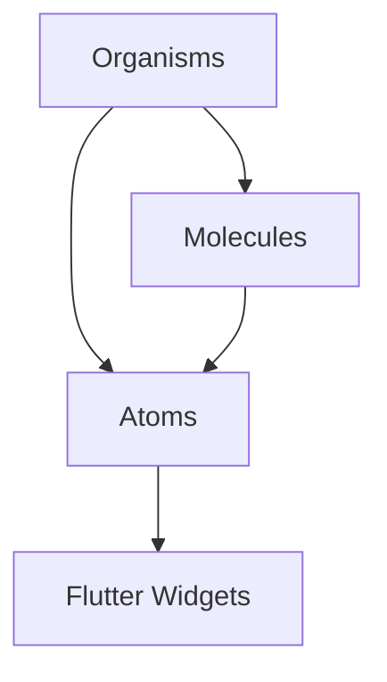

# 🧬 Atomic Design Metodolojisi

Bu dokümantasyon, Office Time Tracker projesinde kullanılan **Atomic Design** metodolojisini ve widget organizasyon yapısını açıklamaktadır.

## 📖 İçindekiler

- [Atomic Design Nedir?](#atomic-design-nedir)
- [Klasör Yapısı](#klasör-yapısı)
- [Atoms (Atomlar)](#atoms-atomlar)
- [Molecules (Moleküller)](#molecules-moleküller)
- [Organisms (Organizmalar)](#organisms-organizmalar)
- [Ayrım Kriterleri](#ayrım-kriterleri)
- [Faydaları](#faydaları)
- [Proje İstatistikleri](#proje-i̇statistikleri)
- [Best Practices](#best-practices)

## Atomic Design Nedir?

**Atomic Design**, Brad Frost tarafından geliştirilen bir tasarım sistemi metodolojisidir. Kimyadan ilham alarak, UI bileşenlerini atom seviyesinden başlayarak hiyerarşik olarak organize eder.

### Temel Prensipler:
- **Modülerlik**: Her bileşen bağımsız ve yeniden kullanılabilir
- **Hiyerarşi**: Küçük parçalardan büyük sistemlere doğru yapılanma
- **Tutarlılık**: Tüm projede standart bileşen kullanımı
- **Sürdürülebilirlik**: Kolay bakım ve geliştirme

## Klasör Yapısı

```
lib/widgets/
├── atoms/           # En küçük UI bileşenleri
├── molecules/       # Atomların birleşimi
├── organisms/       # Karmaşık, tam özellikli bileşenler
└── templates/       # Sayfa şablonları (gelecekte)
```

## ⚛️ Atoms (Atomlar)

### Tanım
En küçük, bölünemez UI bileşenleri. Tek bir sorumluluğa sahip, başka bileşenlere bağımlı olmayan yapılar.

### Özellikler
- ✅ Tek sorumluluk prensibi
- ✅ Yeniden kullanılabilir
- ✅ Props ile konfigüre edilebilir
- ✅ Genellikle stateless
- ✅ 10-50 satır kod

### Projemizdeki Atomlar

#### `SummaryItemWidget`
```dart
// İstatistik gösterimi için temel bileşen
SummaryItemWidget(
  label: 'Toplam Gün',
  value: '15',
  icon: Icons.calendar_today,
  color: AppTheme.primaryColor,
)
```

#### `DetailRowWidget`
```dart
// Label-değer çifti gösterimi
DetailRowWidget(
  label: 'Tarih',
  value: '15/10/2024',
)
```

#### `FilterInfoWidget`
```dart
// Filtre durumu bilgisi
FilterInfoWidget(
  showAllTime: true,
  startDate: startDate,
  endDate: endDate,
)
```

#### `MonthChipWidget`
```dart
// Ay seçim chip'i
MonthChipWidget(
  monthName: 'Ocak',
  isSelected: true,
  onTap: () => selectMonth(1),
)
```

#### `DemoWarningWidget`
```dart
// Demo uyarı mesajı
const DemoWarningWidget()
```

## 🧪 Molecules (Moleküller)

### Tanım
Atomları birleştirerek oluşturulan daha karmaşık bileşenler. Belirli bir işlevi yerine getiren, kullanıcı etkileşimi alabilen yapılar.

### Özellikler
- ✅ Birden fazla atom içerir
- ✅ Belirli bir işlev sunar
- ✅ Local state yönetimi
- ✅ User interaction handling
- ✅ 50-200 satır kod

### Projemizdeki Moleküller

#### `SummaryCardWidget`
```dart
// Özet istatistikleri kartı
SummaryCardWidget(
  totalDays: 30,
  totalHours: 240.5,
  averageHours: 8.0,
)
```
**İçerdiği atomlar**: 3x `SummaryItemWidget`

#### `TimeCardWidget`
```dart
// Zaman seçim kartı
TimeCardWidget(
  title: 'Giriş Saati',
  time: TimeOfDay(hour: 9, minute: 0),
  onTap: selectTime,
  color: AppTheme.checkInColor,
  icon: Icons.login,
)
```

#### `CalendarDayWidget`
```dart
// Takvim günü bileşeni
CalendarDayWidget(
  date: DateTime.now(),
  isSelected: true,
  isToday: false,
  onTap: selectDate,
)
```

#### `RecordDetailsDialog`
```dart
// Kayıt detayları dialog'u
RecordDetailsDialog(
  record: checkInOutRecord,
)
```
**İçerdiği atomlar**: Birden fazla `DetailRowWidget`

#### `GreetingCardWidget`
```dart
// Karşılama kartı
GreetingCardWidget(
  title: 'Hoş Geldiniz!',
  message: 'Yeni bir güne başlayalım.',
)
```

#### `TodayStatusCardWidget`
```dart
// Günlük durum kartı
TodayStatusCardWidget(
  todayRecord: record,
  isDemo: false,
)
```

## 🦠 Organisms (Organizmalar)

### Tanım
Molecule ve atomları birleştiren büyük, bağımsız bileşenler. Tam bir özellik veya section oluşturan karmaşık sistemler.

### Özellikler
- ✅ Tam bir özellik sunar
- ✅ Karmaşık state yönetimi
- ✅ API entegrasyonu
- ✅ Multiple molecules içerir
- ✅ 200+ satır kod

### Projemizdeki Organizmalar

#### `FilterBottomSheetWidget`
```dart
// Gelişmiş tarih filtreleme sistemi
FilterBottomSheetWidget(
  initialStartDate: startDate,
  initialEndDate: endDate,
  onDateRangeChanged: updateFilter,
)
```
**İçerdiği bileşenler**: 
- `CustomCalendarWidget`
- `MonthGridWidget` 
- Multiple atoms

#### `CustomCalendarWidget`
```dart
// Özel takvim sistemi
CustomCalendarWidget(
  currentMonth: DateTime.now(),
  onDateTap: selectDate,
  onDateRangeChanged: updateRange,
)
```
**İçerdiği bileşenler**:
- `CalendarDayWidget` (molecule)
- `MonthGridWidget` (molecule)

#### `WorkHoursChartWidget`
```dart
// Çalışma saatleri grafiği
WorkHoursChartWidget(
  statistics: statisticsData,
)
```
**Özellikler**:
- Chart rendering
- Data processing
- Empty state handling

#### `RecordsListWidget`
```dart
// Kayıt listesi sistemi
RecordsListWidget(
  records: records,
  onTap: showDetails,
  onEdit: editRecord,
  onDelete: deleteRecord,
)
```

#### `HistorySummaryWidget`
```dart
// Geçmiş özet sistemi
HistorySummaryWidget(
  records: filteredRecords,
)
```

## 🎯 Ayrım Kriterleri

### 📏 Boyut ve Karmaşıklık

| Seviye | Satır Sayısı | Karmaşıklık |
|--------|-------------|-------------|
| **Atom** | 10-50 satır | Çok basit |
| **Molecule** | 50-200 satır | Orta |
| **Organism** | 200+ satır | Karmaşık |

### 🔗 Bağımlılık Seviyesi



- **Atom**: Sadece Flutter widget'larına bağımlı
- **Molecule**: Atom'lara bağımlı olabilir
- **Organism**: Atom ve molecule'lere bağımlı olabilir

### ⚡ İşlevsellik Seviyesi

| Seviye | İşlev Türü | Örnek |
|--------|------------|-------|
| **Atom** | Tek işlev | Metin gösterme, ikon gösterme |
| **Molecule** | Birleşik işlev | Form field, card, button group |
| **Organism** | Tam özellik | Filtreleme, grafik, liste yönetimi |

### 🧠 State Yönetimi

| Seviye | State Türü | Örnek |
|--------|------------|-------|
| **Atom** | Stateless/Basit state | Hover, focus durumları |
| **Molecule** | Local state | Form validation, toggle states |
| **Organism** | Karmaşık state | API calls, complex business logic |

## ✅ Faydaları

### 🔄 Yeniden Kullanılabilirlik

```dart
// SummaryItemWidget 3 farklı yerde kullanılıyor:
// 1. HistorySummaryWidget'ta
// 2. StatisticsSummaryWidget'ta
// 3. Gelecekteki başka widget'larda

SummaryItemWidget(
  label: 'Toplam Gün',
  value: '${records.length}',
  icon: Icons.calendar_today,
  color: AppTheme.primaryColor,
)
```

### 🧪 Test Edilebilirlik

```dart
// Her seviye ayrı ayrı test edilebilir:

// Atom testi
testWidgets('SummaryItemWidget displays correct data', (tester) async {
  await tester.pumpWidget(SummaryItemWidget(...));
  expect(find.text('15'), findsOneWidget);
});

// Molecule testi  
testWidgets('SummaryCardWidget calculates totals', (tester) async {
  await tester.pumpWidget(SummaryCardWidget(...));
  // Test molecule behavior
});

// Organism testi
testWidgets('FilterBottomSheet filters data correctly', (tester) async {
  // Integration test
});
```

### 🔧 Bakım Kolaylığı

```dart
// Bir atom'u değiştirdiğinizde:
// ✅ Sadece o atom'u kullanan molecule'ler etkilenir
// ✅ Değişiklik etkisi kontrollü ve öngörülebilir
// ✅ Refactoring riski minimal

// DetailRowWidget'ı değiştirirseniz:
// → Sadece RecordDetailsDialog etkilenir
// → Diğer bileşenler etkilenmez
```

### 👥 Takım Çalışması

```dart
// Farklı experience level'daki developerlar:

// Junior Developer → Atom'lar
class SimpleTextWidget extends StatelessWidget { ... }

// Mid-level Developer → Molecule'ler  
class FormFieldWidget extends StatefulWidget { ... }

// Senior Developer → Organism'ler
class ComplexDataTableWidget extends StatefulWidget { ... }
```

### 📚 Dokümantasyon

Her bileşen kendi dokümantasyonuna sahip:

```dart
/// Özet istatistik göstermek için kullanılan atom bileşeni.
/// 
/// [label]: Gösterilecek etiket
/// [value]: Gösterilecek değer
/// [icon]: Gösterilecek ikon
/// [color]: Tema rengi
class SummaryItemWidget extends StatelessWidget {
  // Implementation
}
```

## 📊 Proje İstatistikleri

### Refactor Öncesi vs Sonrası

| Metrik | Öncesi | Sonrası | İyileşme |
|--------|--------|---------|----------|
| **Toplam Satır** | 3,135 | 1,044 | **-67%** |
| **HistoryPage** | 1,218 | 169 | **-86%** |
| **StatisticsPage** | 638 | 169 | **-73%** |
| **EditRecordPage** | 538 | 334 | **-38%** |
| **DemoPage** | 406 | 204 | **-50%** |
| **HomePage** | 335 | 168 | **-50%** |

### Widget Dağılımı

| Seviye | Adet | Ortalama Satır |
|--------|------|----------------|
| **Atoms** | 5 | ~30 satır |
| **Molecules** | 13 | ~80 satır |
| **Organisms** | 9 | ~150 satır |
| **Toplam** | **27 widget** | - |

### Yeniden Kullanım Oranları

| Widget | Kullanım Yeri | Yeniden Kullanım |
|--------|---------------|------------------|
| `SummaryItemWidget` | 2 organism | ✅ Yüksek |
| `TimeCardWidget` | 1 page | ⚠️ Orta |
| `TodayStatusCardWidget` | 2 page | ✅ Yüksek |
| `StatusMessageWidget` | 2 page | ✅ Yüksek |

## 📋 Best Practices

### ✅ DO (Yapın)

```dart
// ✅ Tek sorumluluk prensibi
class SummaryItemWidget extends StatelessWidget {
  // Sadece özet öğesi gösterir
}

// ✅ Props ile konfigürasyon
SummaryItemWidget(
  label: 'Toplam',
  value: '15',
  color: Colors.blue,
)

// ✅ Açıklayıcı isimlendirme
class WorkHoursChartWidget extends StatelessWidget { ... }

// ✅ Const constructor
const SummaryItemWidget({
  super.key,
  required this.label,
  required this.value,
});
```

### ❌ DON'T (Yapmayın)

```dart
// ❌ Çok fazla sorumluluk
class SuperComplexWidget extends StatelessWidget {
  // Chart + List + Filter + Navigation
}

// ❌ Hard-coded değerler
Text('Toplam Gün: 15') // Bu atom olmamalı

// ❌ Belirsiz isimlendirme
class Widget1 extends StatelessWidget { ... }

// ❌ Gereksiz state
class StaticTextWidget extends StatefulWidget { ... }
```

### 🎯 Atom Oluştururken

```dart
// ✅ İyi atom örneği
class IconLabelWidget extends StatelessWidget {
  final IconData icon;
  final String label;
  final Color? color;
  
  const IconLabelWidget({
    super.key,
    required this.icon,
    required this.label,
    this.color,
  });
  
  @override
  Widget build(BuildContext context) {
    return Row(
      children: [
        Icon(icon, color: color),
        const SizedBox(width: 8),
        Text(label),
      ],
    );
  }
}
```

### 🧪 Molecule Oluştururken

```dart
// ✅ İyi molecule örneği
class StatCardWidget extends StatelessWidget {
  final String title;
  final String value;
  final IconData icon;
  final VoidCallback? onTap;
  
  @override
  Widget build(BuildContext context) {
    return Card(
      child: InkWell(
        onTap: onTap,
        child: Padding(
          padding: const EdgeInsets.all(16),
          child: Column(
            children: [
              IconLabelWidget(icon: icon, label: title), // Atom kullanımı
              const SizedBox(height: 8),
              Text(value, style: Theme.of(context).textTheme.headlineSmall),
            ],
          ),
        ),
      ),
    );
  }
}
```

### 🦠 Organism Oluştururken

```dart
// ✅ İyi organism örneği
class DashboardStatsWidget extends StatelessWidget {
  final List<StatData> stats;
  final Function(StatData) onStatTap;
  
  @override
  Widget build(BuildContext context) {
    return Column(
      children: [
        // Header (molecule)
        DashboardHeaderWidget(title: 'İstatistikler'),
        
        // Stats grid (molecules)
        GridView.builder(
          itemCount: stats.length,
          itemBuilder: (context, index) {
            final stat = stats[index];
            return StatCardWidget( // Molecule kullanımı
              title: stat.title,
              value: stat.value,
              icon: stat.icon,
              onTap: () => onStatTap(stat),
            );
          },
        ),
      ],
    );
  }
}
```

## 🔮 Gelecek Planları

### Templates Klasörü
Sayfa şablonları için `templates/` klasörü eklenmesi planlanıyor:

```
lib/widgets/templates/
├── page_template.dart          # Temel sayfa şablonu
├── dashboard_template.dart     # Dashboard şablonu  
├── list_page_template.dart     # Liste sayfası şablonu
└── detail_page_template.dart   # Detay sayfası şablonu
```

### Theme Integration
Atom seviyesinde tema entegrasyonu:

```dart
class ThemedButtonWidget extends StatelessWidget {
  final ButtonTheme theme;
  // Tema-aware button implementation
}
```

### Storybook Integration
Widget katalogları için Storybook entegrasyonu:

```dart
// stories/atoms/summary_item.stories.dart
Widget summaryItemDefault() => SummaryItemWidget(...);
Widget summaryItemWithLongText() => SummaryItemWidget(...);
```

## 🎉 Sonuç

Atomic Design metodolojisi sayesinde:

- ✅ **%67 daha az kod** (3,135 → 1,044 satır)
- ✅ **27 yeniden kullanılabilir widget**
- ✅ **Çok daha organize yapı**
- ✅ **Kolay test edilebilir bileşenler**
- ✅ **Sürdürülebilir kod tabanı**
- ✅ **Takım dostu geliştirme**

Bu metodoloji, modern Flutter geliştirmede en etkili organizasyon yöntemlerinden biridir ve projenizin büyümesiyle birlikte değerini daha da artıracaktır.

---

**Hazırlayan**: AI Assistant  
**Tarih**: 2024  
**Versiyon**: 1.0  
**Proje**: Office Time Tracker
